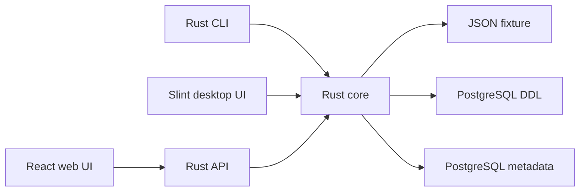

# Architecture

## Architectural goal

The project cleanly separates the business core from the user surfaces. The CLI and desktop UI must work without a server. The web UI uses a dedicated Rust API, because a browser cannot safely connect directly to PostgreSQL.

## Overview

## Components

| Path | Role |
| --- | --- |
| `apps/cli-rust` | CLI, Rust API, and the shared pathfinding core. |
| `apps/desktop` | Local desktop interface built with Slint. |
| `apps/web` | React web interface. |
| `packages/core` | TypeScript contract mirror kept for tests and the web migration. |
| `fixtures/postgres` | PostgreSQL test data and examples. |
| `scripts` | AppImage/Debian packaging and scaffolding checks. |

## Data flow

1. A source is provided: JSON fixture, SQL file, or PostgreSQL URL.
2. The core turns that source into `SchemaMetadata`.
3. Tables and foreign keys become a directed, traversable graph.
4. The pathfinder searches for a path between the source and target tables.
5. The renderer produces the requested format: text, equation, SQL, Mermaid, or JSON.

## Conceptual model

- `TableIdentifier`: schema name + table name.
- `ForeignKeyEdge`: relationship between a source column and a target column.
- `SchemaMetadata`: normalized collection of tables and relationships.
- `ScoredPath`: selected path with a score and segments.

## Why Rust at the center

Rust enables a standalone binary for the CLI and desktop, strict error handling, and simpler packaging for a local tool. The web server is deliberately small: it exposes the same capabilities as the core instead of creating a second business logic.

## Important boundaries

- The CLI and desktop do not need a backend URL.
- The web UI does not connect directly to PostgreSQL: it goes through the API.
- Fixtures contain schema metadata only.
- Generated SQL examples are inspection aids, not queries executed automatically.
