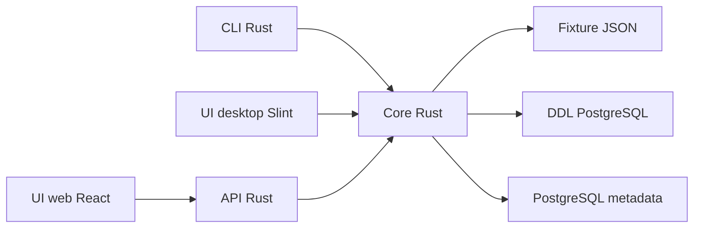

# Architecture

## Objectif d'architecture

Le projet sépare clairement le coeur métier des surfaces utilisateur. Le CLI et l'UI desktop doivent fonctionner sans serveur. L'UI web utilise une API Rust dédiée, car un navigateur ne peut pas se connecter directement à PostgreSQL de façon sûre.

## Vue d'ensemble

## Composants

| Chemin | Rôle |
| --- | --- |
| `apps/cli-rust` | CLI, API Rust et coeur partagé de pathfinding. |
| `apps/desktop` | Interface desktop locale en Slint. |
| `apps/web` | Interface web React. |
| `packages/core` | Miroir TypeScript de contrat conservé pour les tests et la migration web. |
| `fixtures/postgres` | Données de test et exemples PostgreSQL. |
| `scripts` | Packaging AppImage, Debian et checks de scaffolding. |

## Flux de données

1. Une source est fournie : fixture JSON, fichier SQL ou URL PostgreSQL.
2. Le coeur transforme cette source en `SchemaMetadata`.
3. Les tables et foreign keys deviennent un graphe orienté et traversable.
4. Le pathfinder cherche un chemin entre table source et table cible.
5. Le renderer produit le format demandé : texte, equation, SQL, Mermaid ou JSON.

## Modèle conceptuel

- `TableIdentifier` : nom de schéma + nom de table.
- `ForeignKeyEdge` : relation entre une colonne source et une colonne cible.
- `SchemaMetadata` : collection normalisée des tables et relations.
- `ScoredPath` : chemin retenu avec score et segments.

## Pourquoi Rust au centre

Rust permet un binaire autonome pour le CLI et le desktop, une gestion stricte des erreurs, et un packaging plus simple pour un outil local. Le serveur web est volontairement petit : il expose les mêmes capacités que le coeur au lieu de créer une seconde logique métier.

## Frontières importantes

- Le CLI et le desktop n'ont pas besoin d'URL backend.
- L'UI web ne se connecte pas directement à PostgreSQL : elle passe par l'API.
- Les fixtures ne contiennent que des métadonnées de schéma.
- Les exemples SQL générés sont du texte d'aide à l'inspection, pas des requêtes exécutées automatiquement.
